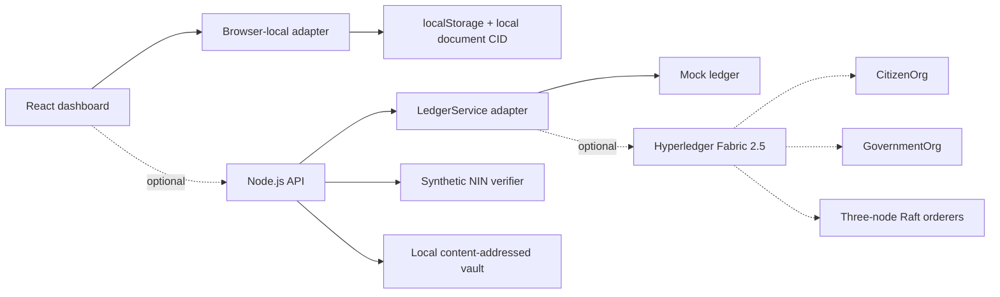

# BLMS — Blockchain-Based Land Management System

BLMS is a locally runnable academic/research prototype for secure and transparent land administration in Nigeria. It is not connected to NIMC, a government registry, a bank, a payment rail, or a production blockchain. All people, properties, identity records, payments, and revenue are synthetic demonstration data.

## Current delivery status

Phases 1–3 plus the offline/static deployment slice are implemented, and the Go land chaincode has been added as the first Fabric-phase artifact. The React dashboard can run entirely in the browser with localStorage, including authentication, user-created parcels, transfers, synthetic identity behavior, document CID checks, audit, and simulated revenue. A fresh static deployment starts with an empty register; no API server, Docker, IPFS node, Fabric network, or environment variable is required for the demo. The Fabric network and Gateway adapter remain optional integration work.

See [implementation_plan.md](./implementation_plan.md) for the full sequence.
See [docs/offline-demo.md](./docs/offline-demo.md) for the complete browser-only walkthrough and [docs/openapi.yaml](./docs/openapi.yaml) for the API reference.

## Prerequisites

- Node.js 20+
- npm 10+

## Run the offline demo (default)

```bash
npm install
npm run dev:offline
```

- Web: http://localhost:5173

The interface shows `LOCAL STATIC DEMO`. Data is stored in the browser only and is clearly synthetic; it is not a blockchain or production authentication system.

To reset the browser demo, clear site storage in the browser or run this in the console:

```js
localStorage.removeItem("blms-offline-demo-v2")
```

## Optional local API mode

```bash
npm run seed
npm run dev:mock
```

This starts the Express API and React app locally. It is not required for the default demo.

The offline document flow uses browser-local content addressing. The API mode can optionally use a local Kubo IPFS API with `npm run ipfs:up` and `IPFS_MODE=http`, but Docker is never required for the default application.

## Fabric mode status

The Go chaincode lives in `blockchain/chaincode/land`. It enforces certificate-based identity, duplicate parcel/title checks, owner-only listings, government-only levies, atomic purchase rules, simulated fee allocation, document CID comparison, history, and `LandTransferred` events. Go and Docker are required only to compile/deploy this optional local network; the offline browser demo remains independent.

## Development demo accounts

These credentials are synthetic and development-only. Never use them in production.

| Username | Password | Role |
| --- | --- | --- |
| `citizen.seller` | `Citizen123!` | Citizen |
| `citizen.buyer` | `Citizen123!` | Citizen |
| `government.officer` | `Government123!` | Government officer |
| `admin` | `Admin123!` | Admin |

## Useful commands

```bash
npm run typecheck
npm test
npm run build
npm run reset
npm run ipfs:up
npm run ipfs:down
```

Fabric/IPFS commands are intentionally placeholders until Phases 3–5. They will be replaced with idempotent Docker and Fabric scripts without changing the API contract.

## Architecture direction



## Netlify deployment without environment variables

The static frontend is configured in `netlify.toml`. Deploy the repository to Netlify with no environment variables; Netlify runs `npm run build -w @blms/web` and publishes `apps/web/dist`. Because no `VITE_API_URL` is present, the production build automatically uses the browser-local adapter.

## Optional free-hosted backend demo

The Express API can be deployed as a small free Render web service for school demonstrations. Use `render.yaml` or configure:

```bash
npm ci && npm run build:api
npm run start:api
```

Set `LEDGER_MODE=mock`, `IPFS_MODE=local`, `WEB_ORIGIN` to the deployed frontend origin, and a strong `JWT_SECRET`. This does not run real Hyperledger Fabric or a persistent Kubo node; it exposes the same backend workflow with simulated ledger proof and local content-addressed document storage. See [docs/free-hosting-deployment.md](./docs/free-hosting-deployment.md).

## Security notes

Passwords are hashed at startup with bcrypt and are never written to the committed user seed file. Sessions use short-lived JWTs in HTTP-only cookies. The mock ledger uses integer kobo values and records simulated settlement allocations; no funds move. Full identity, document, and Fabric certificate handling is explicitly deferred to the later phases.
